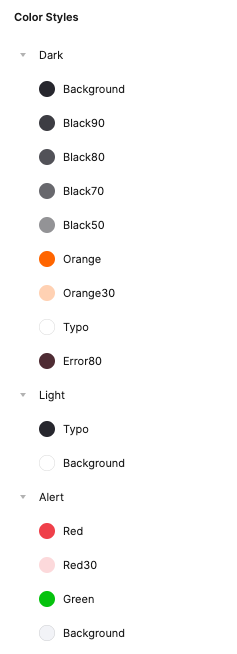
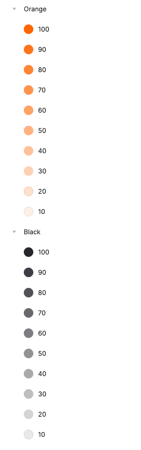
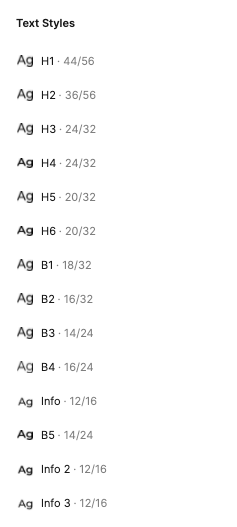
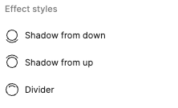

# Figma Generator

## Generate style classes from figma
</br>

## Example
Styles in Figma






Styles in dart class when will be exported

### Colors
```dart
abstract class AppColors {
  const AppColors({
    required this.alert20,
    required this.background,
    required this.black50,
    required this.black70,
    required this.black80,
    required this.black90,
    required this.error80,
    required this.orange,
    required this.orange30,
    required this.typo,
    required this.systemUiOverlayStyle,
  });

  // error
  final Color alert20;

  // dark
  final Color background;
  final Color black50;
  final Color black70;
  final Color black80;
  final Color black90;
  final Color error80;
  final Color orange;
  final Color orange30;
  final Color typo;

  // System
  final SystemUiOverlayStyle systemUiOverlayStyle;

  Map<String, Map<String, Color>> get allColors => {
        "error": errorColors,
        "dark": darkColors,
        "light": lightColors,
      };

  Map<String, Color> get errorColors => {
        "alert20": alert20,
      };

  Map<String, Color> get darkColors => {
        "background": background,
        "black50": black50,
        "black70": black70,
        "black80": black80,
        "black90": black90,
        "error80": error80,
        "orange": orange,
        "orange30": orange30,
        "typo": typo,
      };

  Map<String, Color> get lightColors => {
        "background": background,
        "black50": black50,
        "black70": black70,
        "black80": black80,
        "black90": black90,
        "error80": error80,
        "orange": orange,
        "orange30": orange30,
        "typo": typo,
      };
}

class LightAppColors extends AppColors {
  const LightAppColors()
      : super(
          alert20: const Color(0xFFFCD9DB),
          background: const Color(0xFF27272E),
          black50: const Color(0xFF939396),
          black70: const Color(0xFF68686D),
          black80: const Color(0xFF525258),
          black90: const Color(0xFF3D3D43),
          error80: const Color(0xFF4F2C34),
          orange: const Color(0xFFFF6500),
          orange30: const Color(0xFFFFD1B3),
          typo: const Color(0xFFFFFFFF),
          systemUiOverlayStyle: SystemUiOverlayStyle.dark,
        );
}

class DarkAppColors extends AppColors {
  const DarkAppColors()
      : super(
          alert20: const Color(0xFFFCD9DB),
          background: const Color(0xFF27272E),
          black50: const Color(0xFF939396),
          black70: const Color(0xFF68686D),
          black80: const Color(0xFF525258),
          black90: const Color(0xFF3D3D43),
          error80: const Color(0xFF4F2C34),
          orange: const Color(0xFFFF6500),
          orange30: const Color(0xFFFFD1B3),
          typo: const Color(0xFFFFFFFF),
          systemUiOverlayStyle: SystemUiOverlayStyle.light,
        );
}
```

### Typography

```dart
class AppTypography {
  const AppTypography._();

  static Map<String, TextStyle> get allStyles => {
        "b1": b1,
        "b2": b2,
        "b3": b3,
        "b4": b4,
        "b5": b5,
        "h1": h1,
        "h2": h2,
        "h3": h3,
        "h4": h4,
        "h5": h5,
        "h6": h6,
        "info": info,
        "info 2": info2,
        "info 3": info3,
      };

  static const TextStyle b1 = TextStyle(
    fontFamily: 'Montserrat',
    fontSize: 18,
    height: 1.7777777777777777,
    fontStyle: FontStyle.normal,
    letterSpacing: 0,
    fontWeight: FontWeight.w500,
    decoration: TextDecoration.none,
    debugLabel: "b1",
  );

  static const TextStyle b2 = TextStyle(
    fontFamily: 'Montserrat',
    fontSize: 16,
    height: 2.0,
    fontStyle: FontStyle.normal,
    letterSpacing: 0,
    fontWeight: FontWeight.w500,
    decoration: TextDecoration.none,
    debugLabel: "b2",
  );

  static const TextStyle b3 = TextStyle(
    fontFamily: 'Montserrat',
    fontSize: 14,
    height: 1.7142857142857142,
    fontStyle: FontStyle.normal,
    letterSpacing: 0,
    fontWeight: FontWeight.w500,
    decoration: TextDecoration.none,
    debugLabel: "b3",
  );

  static const TextStyle b4 = TextStyle(
    fontFamily: 'Montserrat',
    fontSize: 16,
    height: 1.5,
    fontStyle: FontStyle.normal,
    letterSpacing: 0,
    fontWeight: FontWeight.w400,
    decoration: TextDecoration.none,
    debugLabel: "b4",
  );

  static const TextStyle b5 = TextStyle(
    fontFamily: 'Montserrat',
    fontSize: 14,
    height: 1.7142857142857142,
    fontStyle: FontStyle.normal,
    letterSpacing: 0,
    fontWeight: FontWeight.w600,
    decoration: TextDecoration.none,
    debugLabel: "b5",
  );

  static const TextStyle h1 = TextStyle(
    fontFamily: 'Montserrat',
    fontSize: 44,
    height: 1.2727272727272727,
    fontStyle: FontStyle.normal,
    letterSpacing: 0,
    fontWeight: FontWeight.w500,
    decoration: TextDecoration.none,
    debugLabel: "h1",
  );

  static const TextStyle h2 = TextStyle(
    fontFamily: 'Montserrat',
    fontSize: 36,
    height: 1.5555555555555556,
    fontStyle: FontStyle.normal,
    letterSpacing: 0,
    fontWeight: FontWeight.w500,
    decoration: TextDecoration.none,
    debugLabel: "h2",
  );

  static const TextStyle h3 = TextStyle(
    fontFamily: 'Montserrat',
    fontSize: 24,
    height: 1.3333333333333333,
    fontStyle: FontStyle.normal,
    letterSpacing: 0,
    fontWeight: FontWeight.w500,
    decoration: TextDecoration.none,
    debugLabel: "h3",
  );

  static const TextStyle h4 = TextStyle(
    fontFamily: 'Montserrat',
    fontSize: 24,
    height: 1.3333333333333333,
    fontStyle: FontStyle.normal,
    letterSpacing: 0,
    fontWeight: FontWeight.w600,
    decoration: TextDecoration.none,
    debugLabel: "h4",
  );

  static const TextStyle h5 = TextStyle(
    fontFamily: 'Montserrat',
    fontSize: 20,
    height: 1.6,
    fontStyle: FontStyle.normal,
    letterSpacing: 0,
    fontWeight: FontWeight.w500,
    decoration: TextDecoration.none,
    debugLabel: "h5",
  );

  static const TextStyle h6 = TextStyle(
    fontFamily: 'Montserrat',
    fontSize: 20,
    height: 1.6,
    fontStyle: FontStyle.normal,
    letterSpacing: 0,
    fontWeight: FontWeight.w600,
    decoration: TextDecoration.none,
    debugLabel: "h6",
  );

  static const TextStyle info = TextStyle(
    fontFamily: 'Montserrat',
    fontSize: 12,
    height: 1.3333333333333333,
    fontStyle: FontStyle.normal,
    letterSpacing: 0,
    fontWeight: FontWeight.w500,
    decoration: TextDecoration.none,
    debugLabel: "info",
  );

  static const TextStyle info2 = TextStyle(
    fontFamily: 'Montserrat',
    fontSize: 12,
    height: 1.3333333333333333,
    fontStyle: FontStyle.normal,
    letterSpacing: 0,
    fontWeight: FontWeight.w600,
    decoration: TextDecoration.none,
    debugLabel: "info2",
  );

  static const TextStyle info3 = TextStyle(
    fontFamily: 'Montserrat',
    fontSize: 12,
    height: 1.3333333333333333,
    fontStyle: FontStyle.normal,
    letterSpacing: 0,
    fontWeight: FontWeight.w500,
    decoration: TextDecoration.none,
    debugLabel: "info3",
  );
}

```

### Dimens

```dart
class AppDimens {
  const AppDimens._();

  static Map<String, double> get allDimens => {
        "zero": 0.0,
        "one": 1.0,
        "xxs": 2.0,
        "xs": 4.0,
        "s": 8.0,
        "xm": 12.0,
        "m": 16.0,
        "ml": 20.0,
        "l": 24.0,
        "xl": 32.0,
        "xxl": 40.0,
        "xxxl": 48.0,
        "c": 56.0,
        "xxc": 72.0,
        "xxxc": 80.0,
      };

  /// zero
  static const zero = 0.0;

  /// one
  static const one = 1.0;

  /// xxs
  static const xxs = 2.0;

  /// xs
  static const xs = 4.0;

  /// s
  static const s = 8.0;

  /// xm
  static const xm = 12.0;

  /// m
  static const m = 16.0;

  /// ml
  static const ml = 20.0;

  /// l
  static const l = 24.0;

  /// xl
  static const xl = 32.0;

  /// xxl
  static const xxl = 40.0;

  /// xxxl
  static const xxxl = 48.0;

  /// c
  static const c = 56.0;

  /// xxc
  static const xxc = 72.0;

  /// xxxc
  static const xxxc = 80.0;
}
```

### Shadows
```dart
class AppShadows {
  const AppShadows._();

  static Map<String, BoxShadow> get allShadows => {
        "divider": divider,
        "shadowFromDown": shadowFromDown,
        "shadowFromUp": shadowFromUp,
      };

  static const BoxShadow divider = BoxShadow(
    blurRadius: 1,
    spreadRadius: 0,
    color: Color(0x0D000000),
    offset: Offset(0, 1),
  );

  static const BoxShadow shadowFromDown = BoxShadow(
    blurRadius: 16,
    spreadRadius: 0,
    color: Color(0x1A000000),
    offset: Offset(0, 8),
  );

  static const BoxShadow shadowFromUp = BoxShadow(
    blurRadius: 16,
    spreadRadius: 0,
    color: Color(0x05000000),
    offset: Offset(0, -8),
  );
}
```

## How to do it

### 1. Prepare colors and font styles accordingly

You must create colors and fonts styles, you can learn how to do it from articale below

🔗 &nbsp;&nbsp;[(Click Me!) How create colors and fonts styles](https://help.figma.com/hc/en-us/articles/360038746534-Create-color-text-effect-and-layout-grid-styles)

</br>

### 2. Install and configure plugin for figma

🔗 &nbsp;&nbsp;[(Click Me!) Design Tokens](https://www.figma.com/community/plugin/888356646278934516/Design-Tokens)

When you have aready installed plugin go to `Plugins > Design Tokens > Settings` and you must changed some parameters.

* in `Filename` section change format from `.tokens.json` to `.json`.
* in `Name conversion` set type to `camelCase`.

Okey, now you can save changes and go to next step!

</br>

### 3. Export to json

- go to `Plugins > Design Tokens > Export Design Token File`
- in `Include types in export` section, check only `Colors` and `Font Styles` option.
- click `Save & Export` and save file to `assets/styles` folder with name `styles.json`.

</br>

### 4. Generate the style classes

if you already have an exported styles file from figma, make sure it's in the folder `assets/styles` and use this command to generate the classes

```dart
  flutter pub run figma_generator:main
```

| Args | Name     | Description                |
| :-------- | :------- | :------------------------- |
| `-h` | `help` | Showing all parameters |
| `-f` | `config` | Config file (defaults is "figma_generator.yaml") |

### Example config

```yaml
figma_generator:
  #Default: assets/styles.json
  source_file_path: assets/styles.json

  #Default: lib/presentation/style
  output_dir: lib/presentation/style

  #Default: AppColors
  colors_class_name: AppColors

  #Default: AppTypography
  typography_class_name: AppTypography

  #Default: AppShadows
  shadows_class_name: AppShadows

  #Default: AppDimens
  dimens_class_name: AppDimens

  #Default for all is true
  generate_colors: true
  generate_typography: true
  generate_shadows: true
  generate_dimens: true

  #Default is empty
  dimens:
    zero: 0
    one: 1
    xxs: 2
    xs: 4
    s: 8
    xm: 12
    m: 16
    ml: 20
    l: 24
    xl: 32
    xxl: 40
    xxxl: 48
    c: 56
    xxc: 72
    xxxc: 80
```
</br>

### 5. There it is, you can already use your styles!

```dart
  Container(
    width: AppDimens.xxxhuge,
    decoration: BoxDecoration(
      color: AppColors.myCoolColor,
      boxShadow: [
        AppShadows.myShadowFromDown
      ],
    ),
    child: Text(
      "YEAH!",
      style: AppTypography.myFontStyle
    ),
  ),
```
</br>

# Design System

## How use it
</br>

### 1. Design system button

To open the design system screen, we need to use the widget `DesignSystemFloatingButton` we use it as a floatingActionButton argument, below is an example

```dart
Scaffold(
  floatingActionButton: DesignSystemFloatingButton(),
),
```

### 2. Parameters

We add the parameters that we want the design system to display to us
```dart
Scaffold(
  floatingActionButton: DesignSystemFloatingButton(
    darkColors: DarkAppColors().allColors,
    lightColors: LightAppColors().allColors,
    typography: AppTypography.allStyles,
    dimens: AppDimens.allDimens,
    shadows: AppShadows.allShadows,
    widgets: [
      ElevatedButton(
        onPressed: () {},
        child: Text("Click Me!"),
      ),
    ],
    assetsDir: 'assets',
  ),
),
```

| Parameters     | Type                | Description                 |
| :------- | :------------------------- | :------------------------- |
| `darkColors` | `Map<String, Map<String, Color>>?` | Show dark colors
| `lightColor` | `Map<String, Map<String, Color>>?` | Show light colors
| `typography` | `Map<String, TextStyle>?` | Show typography
| `dimens` | `Map<String, double>?` | Show dimens
| `shadows` | `Map<String, BoxShadow>?` | Show shadows
| `widgets` | `List<Widget>?` | Show widgets
| `assetsDir` | `String?` | Show assets from dir (defaults is `assets`)
</br>
### How it`s look
</br>


</br>
</br>

# Widget Preview
To display the `Widget Preview` screen just click on the widget you are interested in, additional functionality described below.
* To change the height of the widget, hold your finger on the widget and move it up or down.
* To change the width of the widget, hold your finger on the widget and move it left or right.
* You can also click on the current height or width to set the value manually.
* To center the widget click on `center: false`.
* To disable the centering of the widget we click on the caption `center: true`.
* To restore the widget to its original size we click on the button in the upper right corner.
* The orange area around the widget indicates how much space it actually takes up.


</br>

